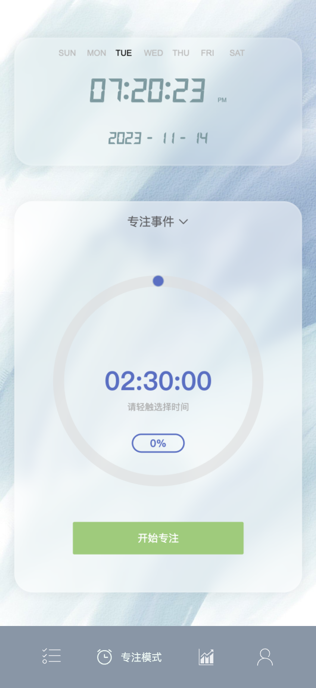
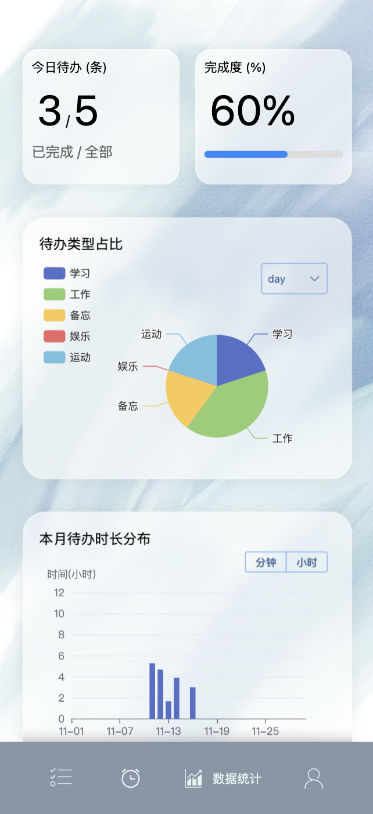
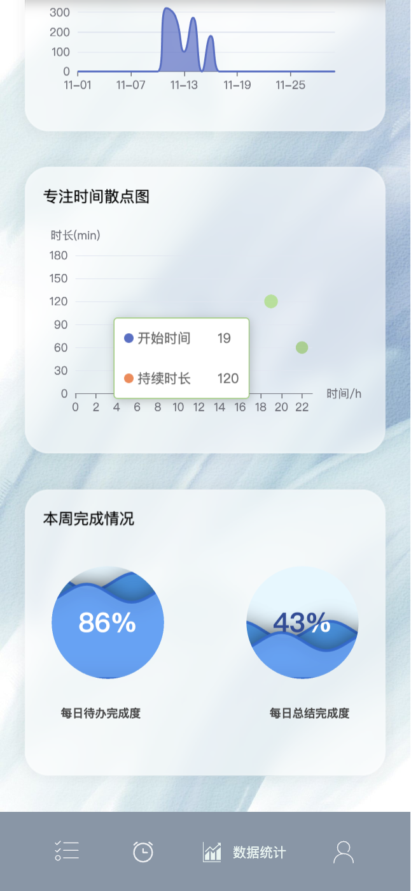

# TODO
## 项目介绍
- 一个简约美观的TODO List应用，包含每日代办、专注模式、数据统计、个人中心等模块；2023年稍作整理，去除部分只适用于个人模块，整理成更通用普适的TODO应用
- 项目地址：https://shawkry.top/todo
- Github：https://github.com/Shawkry/TODO
- 阿里云盘下载链接: https://www.aliyundrive.com/s/fSdY2cvB8Z7

## 项目技术栈
- 前端：Vue3 + TypeScript + Vite + ECharts + VantUI + Element-Plus
- 后端：Nodejs + TypeScript + Express + MongoDB + Mongoose

## 项目启用
- 前端启动
  + 根据 Page/.env.example 内的注释设置相关参数
  + 将 Page 目录下 .env.example 文件，重命名为 .env
  + 安装依赖
  ```
  pnpm install
  ```
  + 启动项目
  ```
  pnpm run start
  ```
- 后端启动
  + 根据 Server/.env.example 内的注释设置相关参数（注意生产模式下默认开启https，需要部署服务器有相关的https证书）
  + 将 Server 目录下 .env.example 文件，重命名为 .env
  + 安装依赖
    ```
    pnpm install
    ```
  + 启动项目
    ```
    pnpm run start
    ```

## 项目预览：

### 登陆页面：


### 每日代办模块：


### 专注模式模块：



### 数据统计模块：





### 个人中心


