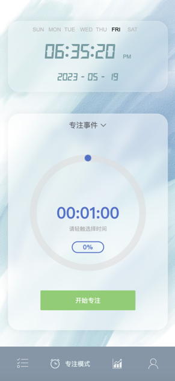

# TODO
## 项目介绍
- 一个简约美观的todo-list应用，包含每日代办、专注模式、数据统计、个人中心等模块；大三无聊写的项目，2023年稍作整理，去除部分只适用于个人模块，整理成更通用普适的TODO应用
- 项目地址：https://shawry14.top/todo-list
## 项目启用
- 前端启动
  + 安装依赖
  ```
  npm install
  ```
  + 启动项目
  ```
  npm run start
  ```
- 后端启动
  + 进入config文件夹，按照example.ts修改config目录中的相关配置
  + 安装依赖
    ```
    npm install
    ```
  + 启动项目
    ```
    npm run start
    ```
## 项目技术
- 前端：vue3+Typescript+vite+echarts+vant+element-plus
- 后端：nodejs+express+mongodb

## 项目预览：

- 登陆页面：

  

- 每日代办模块：

  

- 专注模式模块：

  

- 数据统计模块：

  

- 个人中心

  

